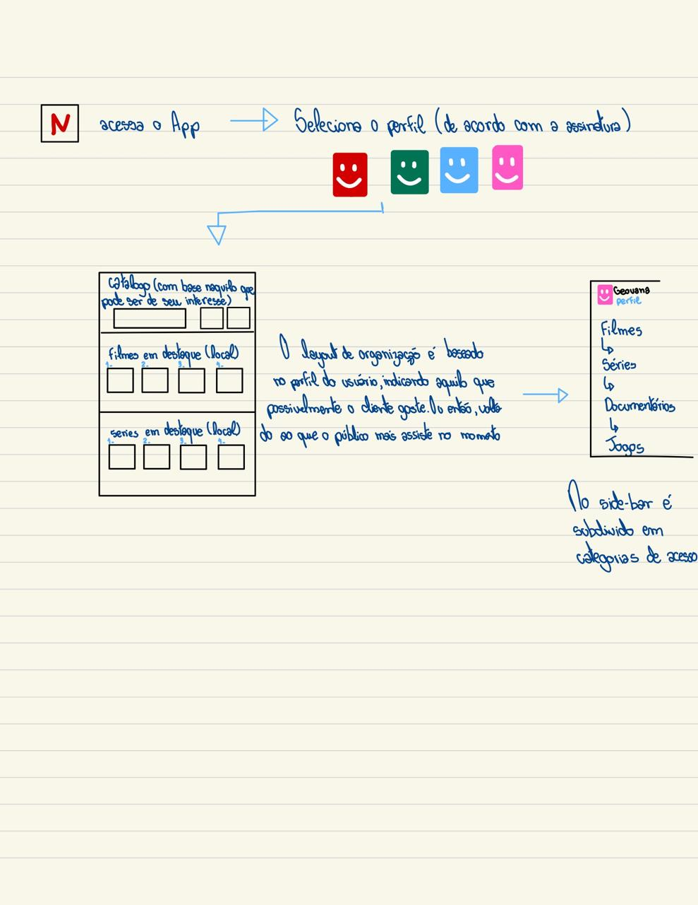
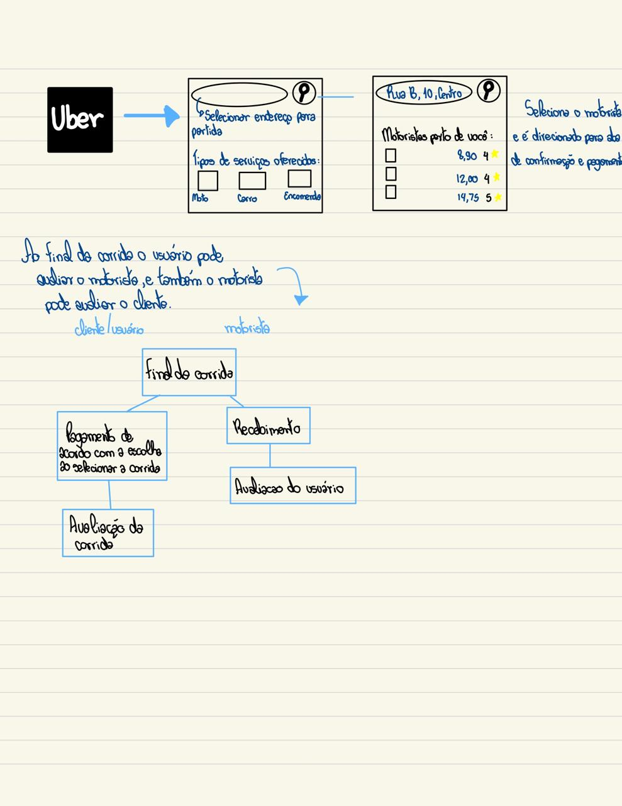
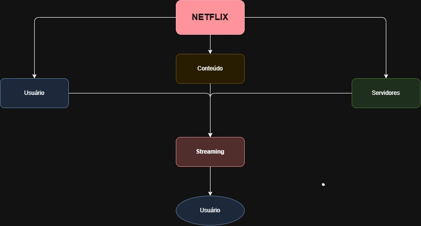
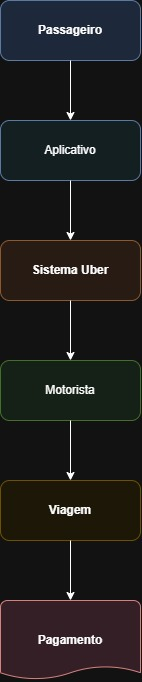
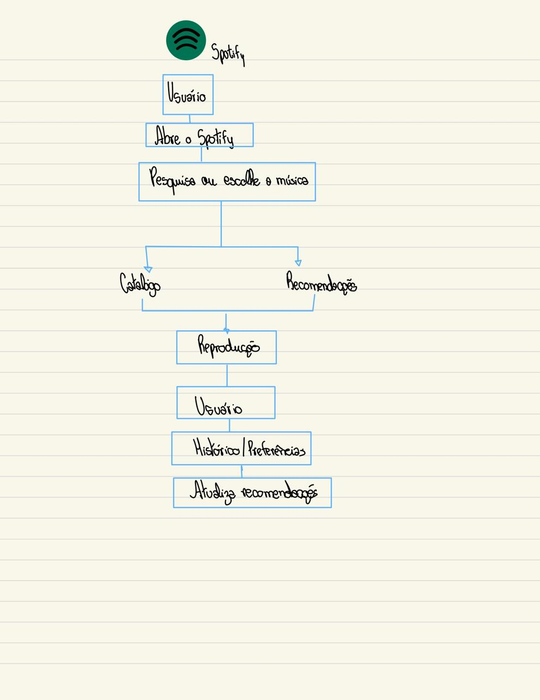

# Modelagem — Resolução da Atividade Aula 1.2

**Aluno(a):** Geovanna
**Matrícula:** 32421BSI000
**Curso:** Bacharelado em Sistemas de Informação (BSI) — UFU
**Data de entrega:** [15/09/2026]
**Professor(a):** Victor Sobreira

---
## Questão 1

**Enunciado:**
> ATIVIDADE:: COMO FUNCIONA A NETFLIX
• Pense a respeito do funcionamento de uma plataforma de
Streaming como a Netflix...
• Como explicaria o seu funcionamento para alguém?
• Tente sintetizar e expressar seu entendimento na forma de um
modelo (em papel).

**Resolução:**

*Figura 1 — Diagrama de como funciona a netflix em minha visão.*

---
## Questão 2

**Enunciado:**
> COMO FUNCIONA A NETFLIX? (2)
1. A partir dos modelos vistos, refaça os comparativos.
2. Analise e indique o propósito e funcionalidade de cada modelo.
3. Qual é o melhor? Para quem? Por quê? 

**Resolução:**

Não existe um único modelo que seja o melhor para todas as situações.

Para um usuário comum, eu considero o infográfico melhor porque é mais simples de entender.

Para um desenvolvedor ou profissional de tecnologia, a arquitetura do sistema seria mais útil porque apresenta informações técnicas.

Para uma pessoa interessada na empresa, o modelo de negócios seria mais adequado.

Então, o melhor modelo depende do objetivo e de quem vai utilizá-lo.

---
## Questão 3

**Enunciado:**
> COMO FUNCIONA A UBER? (1)
• Vamos repetir o processo, considerando agora o Uber.
• Novamente, pense a respeito do seu funcionamento...
• Como explicá-lo para alguém?
• Sintetize e expresse seu entendimento na forma de um modelo (em
papel).

**Resolução:**

*Figura 2 — Diagrama de como funciona a UBER em minha visão.*

---

## Questão 4

**Enunciado:**
> ATIVIDADE:: MODELOS MENTAIS (1)
1. 
Para cada sistema apresentado, recrie um dos diagramas vistos
usando as ferramentas indicadas (ou alguma de sua escolha e
familiaridade). Procure reproduzir o mais próximo possível do
original, utilizando os recursos da ferramenta. Comente as
diferenças e limitações da ferramenta (se houver).

**Resolução:**

Para recriar os diagramas, eu utilizaria uma ferramenta como o Draw.io, pois ela permite criar diagramas utilizando caixas, setas, linhas e outros elementos.

**Para o modelo da Netflix, por exemplo:**

*Figura 3 — Diagrama usando Draw.io para explicar a Netflix.*

**Para a Uber:**

*Figura 4 — Diagrama usando Draw.io para explicar a Uber.*

2. 
Considere os diagramas que você esboçou e discutiu com os
colegas. Da mesma forma, recrie uma versão mais refinada destes
diagramas usando as ferramentas.
3. 
Considere outras plataformas e sistemas populares. Repita os
exercícios feitos com a Netflix e Uber para consolidar e exercitar sua
capacidade de modelagem com as ferramentas sugeridas. Escolha
ao menos uma para este exercício (por exemplo, Spotify, AWS,
AirBnB, Google Search, Twitter, TikTok, WhatsApp).

**Resolução:**

Escolhi o Spotify para aplicar o mesmo exercício.
Como funciona o Spotify?
O Spotify é uma plataforma de streaming de músicas e podcasts. O usuário cria uma conta e pode procurar artistas, músicas, álbuns ou playlists.
A plataforma também utiliza o histórico e as preferências do usuário para fazer recomendações.

*Figura 4 — Modelo mental explicando o funcionamento do Spotify.*