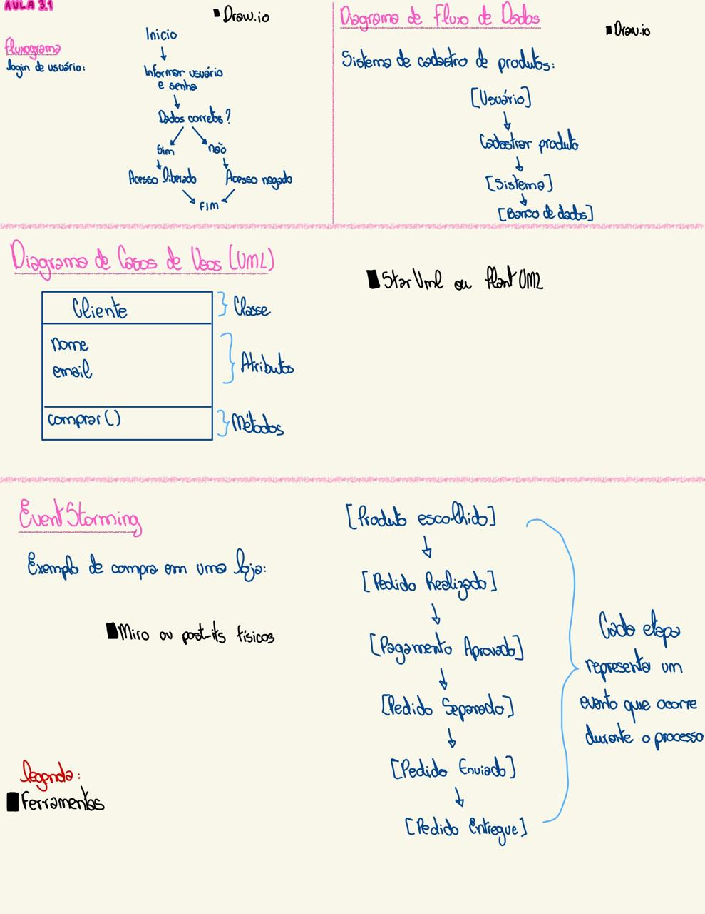

# MODELAGEM — Resolução da Atividade AULA 1.3

**Aluno(a):** Geovanna de Oliveira Xavier
**Matrícula:** 32421BSI006
**Curso:** Bacharelado em Sistemas de Informação (BSI) — UFU
**Data de entrega:** 23/09/2026
**Professor(a):** Victor Sobreira

---

## Sumário

- [Questão 1](#questão-1)
- [Questão 2](#questão-2)
- [Questão 3](#questão-3)
- [Questão 4](#questão-4)

---

## Questão 1

**Enunciado:**
1. Pesquise sobre as principais técnicas desenvolvidas ao longo dos anos envolvendo a Modelagem de Software, citando ao menos um exemplo mais notável de cada década.

**Resolução:**

-Década de 1970: Foco no desenvolvimento de técnicas de análise e projeto estruturado. Os exemplos mais notáveis são a decomposição funcional, os Diagramas de Fluxo de Dados (DFDs) e a modelagem de dados utilizando o Diagrama de Entidade-Relacionamento (DER).

-Década de 1980: Marcada pela popularização do paradigma Orientado a Objetos (OO) e o surgimento das primeiras notações e métodos para modelar sistemas OO.  

-Década de 1990: Ocorreu a proliferação de metodologias para modelagem OO, como Booch, OMT e OOSE. Em 1997, essas abordagens foram unificadas na criação da UML (Unified Modeling Language), que se tornou a linguagem padrão pela OMG.   

-De 2000 em diante: Ascensão do Manifesto Ágil e da modelagem pragmática, introduzindo técnicas mais leves como User Stories e cartões CRC. Também se destaca a consolidação de abordagens dirigidas por modelos (como o DDD) e a modelagem focada em arquitetura de sistemas distribuídos, como o C4 Model e Archimate.  

---

## Questão 2

**Enunciado:**
2. Indique os recursos que melhor explicam as técnicas encontradas (livros, artigos, palestras, ...).

**Resolução:**

*- UML:* O livro "The Unified Modeling Language User Guide", escrito por Grady Booch, James Rumbaugh e Ivar Jacobson (conhecidos como os "três amigos" que unificaram o campo na década de 1990).   
*- Domain-Driven Design (DDD):* O livro "Domain-Driven Design: Tackling Complexity in the Heart of Software", de Eric Evans, que estabelece os fundamentos citados nas abordagens modernas a partir dos anos 2000.  
*- Modelagem Ágil e Arquitetural:* O próprio "Manifesto Ágil" (artigos e princípios online) e a documentação oficial do C4 Model de Simon Brown, recursos fundamentais para contornar a "paralisia da análise" gerada por modelos mais pesados.

---

## Questão 3

**Enunciado:**
3. Descreva brevemente o propósito e aplicação dessa técnica quando foi proposta e comente se ainda continua sendo relevante nos dias de hoje.

**Resolução:**

*-DER e DFDs (1970s):* Foram propostos originalmente para lidar com a crise do software, estruturando dados e fluxos para construir sistemas complexos de forma menos caótica. 
 -Relevância atual: O DER continua sendo a base absoluta para o projeto de bancos de dados relacionais moderno, embora os DFDs sejam menos utilizados.

*-UML (1990s):* Surgiu com o propósito de padronizar a comunicação entre desenvolvedores, resolvendo a confusão causada por várias metodologias concorrentes. 
 -Relevância atual: Continua sendo ensinada e utilizada, mas sua aplicação prática nas empresas tornou-se mais restrita aos diagramas essenciais, já que sua expansão a tornou complexa e geradora de excessos na documentação.

*-Modelagem Ágil e Arquitetura (2000+):* Propostas para focar na entrega de software funcional, reduzindo excessos no planejamento. Modelagens arquiteturais surgiram para suprir as novas demandas de microserviços e computação em nuvem. 
 -Relevância atual: São altamente relevantes e representam o padrão atual da indústria de desenvolvimento.

---

## Questão 4

**Enunciado:**
4. Ilustre com exemplos de modelos gerados pelas técnicas citadas, destacando as ferramentas utilizadas para a modelagem.

**Resolução:**

*Figura 1 — Ilustração de modelos*
