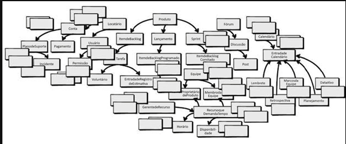

# MODELAGEM — Resolução da Atividade AULA 2.1

**Aluno(a):** Geovanna De Oliveira Xavier
**Matrícula:** 32421BSI0006
**Curso:** Bacharelado em Sistemas de Informação (BSI) — UFU
**Data de entrega:** 02/10/2026
**Professor(a):** Victor Sobreira

---

## Sumário

- [ DDD: Por quê? Atividade:: Analogia](#questão-1--ddd-por-quê-atividade-analogia)
- [Atividade:: Exemplos práticos](#questão-2--atividade-exemplos-práticos)
- [Atividade:: Limitações](#questão-3--atividade-limitações)
- [Atividade:: Domínio Central](#questão-4--atividade-domínio-central)
- [Atividade:: Linguagem Ubíqua](#questão-5--atividade-linguagem-ubíqua)
- [Atividade:: Reflexão](#questão-6--atividade-reflexão-1)
- [Atividade:: Aplicando DDD](#questão-7--atividade-aplicando-ddd)

---

## Questão 1 : DDD: Por quê? Atividade:: Analogia

**Enunciado:**
> 1. Compare e comente como se dá a construção de estradas:
• feitas sobre caminhos antigos de carroças
• planejadas para atender diversas demandas de uma cidade (meio ambiente,fluxo, eficiência economia, ...).

**Resolução:**

A estrada feita sobre um caminho antigo aproveita algo que já existe, mas pode não atender bem às necessidades atuais. Já a estrada planejada é pensada de acordo com o trânsito, segurança, meio ambiente e economia.

---

**Enunciado:**
> 2. Quais modelos/projetos podem ser pensados para cada situação?

**Resolução:**

Para o caminho antigo, pode ser feita uma adaptação do que já existe. Para a cidade, pode ser feito um projeto completo, pensando nas necessidades antes da construção.

---

**Enunciado:**
> 3. Qual dará o melhor resultado aos interessados? Analise os impactos das opções.

**Resolução:**

A estrada planejada tende a dar um resultado melhor, pois evita problemas futuros e atende melhor às pessoas. A outra pode ser mais simples no começo, mas pode gerar problemas depois.

---

## Questão 2 : Atividade:: Exemplos práticos

**Enunciado:**
> 1. Estude os exemplos anteriores e faça um breve resumo sobre seu entendimento dos casos;

**Resolução:**

 Os exemplos mostram que o DDD ajuda a entender melhor o problema e as necessidades do negócio antes de desenvolver o sistema. Com isso, o sistema fica mais organizado e mais próximo do que os usuários realmente precisam.

---

**Enunciado:**
> 2. Identifique conceitos e elementos de DDD citados nesses exemplos;

**Resolução:**

 Alguns conceitos de DDD presentes nos exemplos são: **domínio, linguagem ubíqua, modelos, contextos delimitados (Bounded Contexts) e eventos de domínio**.

---

**Enunciado:**
> 3. Pesquise e cite outros dois casos de sucesso e aplicação da DDD em sistemas conhecidos.

**Resolução:**

Dois exemplos de aplicação são:

- *iFood:* utilizou DDD para organizar sua área financeira em diferentes domínios e microserviços, melhorando o desenvolvimento de novas funcionalidades.
- *The Guardian:* a plataforma do jornal foi reconstruída utilizando princípios de DDD para organizar melhor o sistema e envolver os especialistas do domínio

---

**Enunciado:**
> 2. Quais modelos/projetos podem ser pensados para cada situação?

**Resolução:**

Para o caminho antigo, pode ser feita uma adaptação do que já existe. Para a cidade, pode ser feito um projeto completo, pensando nas necessidades antes da construção.

---

## Questão 3 : Atividade:: Limitações

**Enunciado:**
> 1. Pesquise casos em que a DDD não foi aplicada com sucesso;

**Resolução:**

 - MVP de Startup (E-commerce): Tentar usar DDD completo no lançamento de um produto inicial. Com o modelo de negócio mudando toda semana, a equipe gastava mais tempo reescrevendo abstrações do que entregando recursos.   
 - Sistema CRUD / Interno: Reescrever sistemas simples de cadastro usando padrões táticos de DDD. Gerou over-engineering (superengenharia), criando dezenas de classes e tabelas desnecessárias para lógicas simples.

---

**Enunciado:**
> 2. Comente as causas apontadas para a falha;

**Resolução:**

- Over-engineering: Aplicar DDD em sistemas simples (CRUD, utilitários, conversores) onde não há complexidade de negócio. 
- Domínio Instável: Tentar criar modelos rígidos em projetos sem regras consolidadas ou em fase de validação.   
- Falta de Especialistas: Aplicar DDD de forma isolada pela equipe de TI, sem contato direto com quem entende do negócio. 

---

**Enunciado:**
> 3. Indique qual foi a alternativa para lidar com a situação.

**Resolução:**

- Arquiteturas Orientadas a Dados: Voltar para modelos diretos como MVC simples ou Active Record para telas CRUD. 
- Evolução Gradual: Focar primeiro em código simples e flexível para validar o MVP, introduzindo o DDD apenas se o negócio crescer e se tornar complexo.

---

## Questão 4 : Atividade:: Domínio Central

**Enunciado:**
> 1.  Considerando o desenvolvimento de um sistema para um , indique quais conceitos poderiam ser considerados para seu Domínio Central;

**Resolução:**

 Considerando o exemplo clássico de um e-commerce/plataforma de vendas:   
 -Base e Gestão de Ofertas e Produtos: Cadastro de itens comercializados, variações, preços e disponibilidade.   Carrinho e Processamento de -Pedidos: Regras para fechamento de compra, aplicação de cupom, cálculo de descontos e alteração de estados do pedido.   Acompanhamento de - -Entregas: Rastreio do status da encomenda desde a aprovação até o envio/entrega. 

---

**Enunciado:**
> 2. Justifique as motivações para incluir estes elementos;

**Resolução:**

Vantagem Competitiva e Core Business: O Domínio Central representa a atividade diferencial e estratégica da organização. No e-commerce, o que gera valor direto ao negócio é permitir a escolha dos produtos e garantir a conversão e o processamento eficiente do pedido.   
Lógica Única do Negócio: É onde residem as regras de negócio complexas e específicas que não podem ser substituídas facilmente por soluções de prateleira ou serviços genéricos

---

**Enunciado:**
> 3.  Indique conceitos importantes para esse domínio, mas que ficariam de fora do Domínio Central. Justifique.

**Resolução:**

Cálculo de Rotas e Mapas (Logística Geográfica):  
-Justificativa: Pode ser terceirizado ou resolvido integrando APIs prontas (como Google Maps ou rotas do Correios/transportadoras), pois desenhar mapas não é a atividade principal do e-commerce.

Processamento de Pagamentos (Gateway de Cartão/Pix):   
-Justificativa: Embora essencial para cobrar a transação, a execução técnica do pagamento costuma ser delegada a domínios/serviços externos (gateways bancários)

---

## Questão 5 : Atividade:: Linguagem Ubíqua

**Enunciado:**
> 1. Defina e caracterize os possíveis usos desse termo, levando em conta seu uso por diferentes áreas como Controle de Tráfego, Aquisição de Passagens, Faturamento e Manutenção.

**Resolução:**

Controle de Tráfego Air/Operacional: Refere-se à operação física em tempo real. O foco está na aeronave no ar, rota, altitude, horários de decolagem/pouso reais (ETD/ETA), plano de voo e espaço aéreo. 

Aquisição de Passagens (Comercial / Vendas): Refere-se a uma oferta comercial de transporte. O foco é a disponibilidade de assentos, classes de tarifa, itinerário (origem/destino), trechos com conexão e preços para o passageiro.  

Faturamento (Financeiro / Contabilidade): Refere-se a uma unidade de receita e custo. O foco está nas passagens vendidas por voo, taxas aeroportuárias, consumo de combustível, tributação e balanço financeiro da rota.   

Manutenção (Engenharia / Frota): Refere-se ao desgaste e ciclo operacional da aeronave. O foco está nas horas de voo acumuladas (flight hours), ciclos de decolagem/pouso, inspeções obrigatórias e prontidão técnica do avião. 

---

**Enunciado:**
> 2. Quais seriam os possíveis domínios onde esse termo seria aplicado?

**Resolução:**

Domínio de Operações de Voo / Tráfego Aéreo: Gerencia o acompanhamento dos voos ativos, planos de rota e controle em tempo real.   Domínio de Vendas e Reservas: Responsável pelo catálogo de rotas, inventário de assentos e bilhetagem para clientes.   

Domínio Financeiro e Faturamento: Lida com acerto de contas, bilhetes emitidos, repasses de taxas e análise de rentabilidade de rotas.

Domínio de Manutenção e Frota: Lida com a escala física dos aviões, controle de ciclos das peças e histórico técnico de voo da aeronave.

---

## Questão 6 : Atividade:: Reflexão (1)

**Enunciado:**
> 1. Estaria a equipe caindo em um armadilha?

**Resolução:**

Sim. A equipe caiu na armadilha de tentar modelar absolutamente tudo dentro de um único modelo conceitual gigante. À medida que novos requisitos foram surgindo (como pagamentos, suporte, RH, fóruns e calendários), tudo foi sendo acoplado sem limites claros, caminhando diretamente para o anti-padrão Grande Bola de Lama (Big Ball of Mud).

---

**Enunciado:**
> 2. Houve desvio dos conceitos originais associados a projetos Scrum? (Produtos, Itens de Backlog, Lançamentos, Sprints, ...)

**Resolução:**

Sim. O foco original do sistema, que era gerenciar projetos Scrum (Produtos, Backlogs, Sprints e Lançamentos) , ficou totalmente soterrado e diluído por funcionalidades periféricas e de suporte (como controle financeiro, chamados de suporte e folha/disponibilidade de RH). O modelo perdeu a clareza de qual era o seu Core Domain (Domínio Central).

---

**Enunciado:**
> 3.  O que dizer sobre a linguagem? É clara ou confusa? É consistente? É funcional?

**Resolução:**

Confusa, inconsistente e pouco funcional. Termos Genéricos ou fora do contexto foram misturados (como usar "Locatário" ou "Usuário" para representar conceitos específicos de equipes e papéis Scrum). Não há uma Linguagem Ubíqua bem definida; a mesma palavra assume papéis diferentes ou perde o sentido prático dentro do contexto de desenvolvimento ágil.

---
**Enunciado:**
> 4. Ainda, haverá mais conceitos de suporte a cada conceito nomeado...

**Resolução:**

Exato. Sem a delimitação de Contextos Delimitados (Bounded Contexts), a tendência é uma reação em cadeia de complexidade crescente: cada novo conceito adicionado (ex: "Suporte") traz a necessidade de outros sub-conceitos (ex: "Atendente", "SLA", "Prioridade"), tornando o modelo impraticável de manter e evoluir se continuar unificado.

---

**Enunciado:**

> 5. Caminhamos para uma "Grande Bola de Lama"?

**Resolução:**

Sim, com certeza. O sistema está se tornando um modelo monolítico, confuso e sem limites explícitos (uma Big Ball of Mud). Como novos conceitos de domínios completamente diferentes (Scrum, Vendas/Cobrança, RH, Fóruns/Rede Social e Suporte) continuam sendo acoplados no mesmo diagrama sem segregação, a complexidade do código vai disparar e a manutenção se tornará inviável.

---

**Enunciado:**
> 6. Como lidar com isso?

**Resolução:**

Definir Contextos Delimitados (Bounded Contexts): Dividir o sistema em contextos menores e independentes. O foco do Core Domain deve ficar restrito ao gerenciamento Scrum (Produtos, Backlogs, Sprints).   

Isolar Domínios de Suporte e Genéricos: Separar funcionalidades de Pagamentos/Planos, Suporte/SLA e Gestão de Pessoas em outros contextos ou subdomínios específicos.   

Estabelecer uma Linguagem Ubíqua para cada Contexto: Garantir que os termos façam sentido estrito dentro do seu próprio contexto (ex: usar Proprietário de Produto e Membro da Equipe no contexto Scrum, e usar Cliente/Assinante no contexto de Pagamentos).   

Utilizar Mapeamento de Contextos (Context Map): Definir como esses diferentes contextos vão se integrar e conversar entre si de forma desacoplada (usando eventos de domínio ou APIs).

---

## Questão 7 : Atividade:: Aplicando DDD

**Enunciado:**
> 1. Repasse o estudo de caso e, com base nas ideias vistas, tente definir quais seriam os elementos pertinentes ao domínio central de um serviço de Transporte de Passeio

**Resolução:**

Corrida / Viagem: Solicitação, aceite, rastreio em tempo real do trajeto e finalização do destino.  
Match / Pareamento: Algoritmo e lógica de associação entre a solicitação do passageiro e o motorista mais adequado próximo.  
Precificação Dinâmica: Cálculo do valor da corrida (tarifa base, distância, tempo e taxa multiplicadora por demanda).

---

**Enunciado:**
> 2. Aponte quais seriam os outros domínios relacionados ao domínio central.

**Resolução:**

Domínio de Pagamento e Faturamento: Processamento de cobrança no cartão/Pix, repasse de valores ao motorista e carteira digital.  
Domínio de Cadastro e Cadastramento de Condutores/Veículos: Validação de CNH, vistoria de veículos e verificação de antecedentes.  
Domínio de Geolocalização e Rotas: Serviço técnico de mapas, cálculo de rota física, geocodificação de endereços e estimativa de tempo (ETA).  
Domínio de Avaliação e Suporte: Notas de passageiros/motoristas, suporte a itens perdidos e reclamações.

---

**Enunciado:**
> 3.  Identifique quais elementos do domínio central estariam ligados aos domínios em seu entorno.

**Resolução:**

Corrida $\leftrightarrow$ Geolocalização: A Corrida utiliza as coordenadas do serviço de mapas para traçar o percurso e estimar a chegada.   Corrida $\leftrightarrow$ Pagamento: O encerramento da Corrida spara um evento de cobrança para o domínio financeiro.  
Match $\leftrightarrow$ Cadastro de Condutores: O Match só considera motoristas cujo status no domínio de cadastro seja "Ativo e Regularizado".

---
**Enunciado:**
> 4. Identifique termos comuns a mais de um domínio, mas com significados distintos.

**Resolução:**

"Motorista":
No Domínio de Cadastro: É a pessoa física, com documentos (CNH, CPF), conta bancária e validações de segurança.   
No Domínio Central (Corrida): É uma entidade ativa no mapa, identificada por localização geográfica atual, disponibilidade (online/ocupado) e tempo de resposta.

"Tarifa":
No Domínio Central: É o valor dinâmico estimado/calculado para uma viagem com base na demanda instantânea.   
No Domínio Financeiro: É a taxa de comissão percentual retida pela plataforma para fins de faturamento e imposto.
---

**Enunciado:**
> 5. Repita o exercício, considerando um sistema de Entrega de Comida.

**Resolução:**

**Elementos do Domínio Central (Core Domain)**   
Pedido de Comida: Montagem da sacola, escolha de itens/adicionais, validação de regras do restaurante e estados do pedido (Aguardando aprovação, Em preparo, Pronto, Em rota).   
Cardápio e Oferta: Catálogo dinâmico de pratos, horários de funcionamento do restaurante e disponibilidade de itens em estoque.   Despacho e Logística de Entrega: Atribuição do entregador ao restaurante e acompanhamento da entrega até o cliente.  

**Domínios Relacionados (Suporte e Genéricos)**   
Domínio de Pagamento: Processamento do pagamento online ou indicação de cobrança na entrega.   
Domínio de Onboarding e Gestão de Restaurantes: Contratos, repasses financeiros comerciais e configuração da loja.   
Domínio de Promoções e Fidelidade: Gestão de cupons de desconto, programas de pontos e frete grátis.   
Domínio de Comunicação e Notificações: Envio de SMS, notificações push e chat entre cliente, restaurante e entregador. 

**Integrações entre Domínio Central e Entorno**  
Pedido $\leftrightarrow$ Pagamento: A confirmação do Pedido depende da autorização prévia de saldo no domínio de pagamentos.   
Pedido $\leftrightarrow$ Promoções: O cálculo do total do Pedido consulta o domínio de promoções para aplicar as regras do cupom informado.   Despacho $\leftrightarrow$ Notificações: A mudança de estado da entrega ("Entregador a caminho") dispara notificações automáticas ao cliente.

**Termos comuns com significados distintos (Linguagem Ubíqua em diferentes Contextos)**   
"Item":No Domínio Central (Cardápio/Pedido): É o prato ou refeição escolhida (ex: Pizza de Calabresa), com suas opções de complementos e observações do cliente.  
No Domínio de Estoque/Restaurante: São os insumos e ingredientes físicos necessários na cozinha para preparar a refeição.   
"Status":No Domínio Central (Pedido): Representa a etapa do fluxo do pedido de comida (Aprovado, Em Preparo, Saiu para Entrega).   
No Domínio de Restaurantes: Indica a visibilidade operacional da loja no aplicativo (Aberto, Fechado, Pausa para Almoço).

---